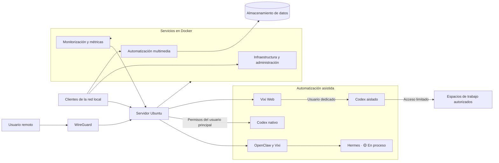

# VIXI Homelab

Este repositorio recoge la documentación pública de mi homelab. Está montado sobre Ubuntu Server y contenedores, y reúne servicios de infraestructura, multimedia, monitorización y automatización. También incluye OpenClaw con Vixi, integración con Codex y un entorno aislado para automatizaciones con permisos limitados.

Aquí explico cómo está organizado y por qué tomé algunas decisiones técnicas, pero sin publicar direcciones de red, credenciales, secretos ni otros datos internos.

## Estado del proyecto

| Estado | Área | Situación |
|---|---|---|
| ✅ Implementado | Plataforma base | Servidor físico con Ubuntu Server 24.04 LTS, almacenamiento separado para el sistema y los datos, Docker y Docker Compose. |
| ✅ Implementado | Infraestructura | Pi-hole, WireGuard, Portainer, Uptime Kuma y actualizaciones automáticas solo para servicios seleccionados. |
| ✅ Implementado | Multimedia | Gestión, descarga, organización y reproducción multimedia mediante un flujo automatizado. |
| ✅ Implementado | Monitorización | Prometheus y sus exportadores recogen métricas del host, los contenedores y el estado SMART. Grafana las muestra en paneles. |
| ✅ Implementado | Seguridad | Firewall, protección de SSH, AppArmor, acceso remoto privado y servicios de red local restringidos. |
| ✅ Implementado | Automatización asistida | OpenClaw con Vixi como agente principal. Codex nativo se ejecuta con los permisos del usuario principal, y Vixi Web tiene además un entorno Codex aislado limitado a espacios de trabajo autorizados. |
| ✅ Implementado | Documentación v1 | La primera versión pública está cerrada y revisada. Seguirá evolucionando junto al homelab. |
| 🟡 En proceso | Hermes | Ya existe como agente separado, pero su arquitectura de delegación, especialización y futuros subagentes sigue en desarrollo. |
| 🟡 En proceso | Porfolio | El porfolio profesional sigue en desarrollo y revisión. |
| 🟡 En proceso | Copias de seguridad | Estoy sustituyendo la solución provisional por una estrategia cifrada, versionada y verificable. |
| 🟡 En proceso | Monitorización avanzada | Todavía tengo que revisar las métricas de red y completar las alertas y notificaciones. |

## Arquitectura general

El diagrama no incluye direcciones, subredes, dominios ni rutas reales.

## Tecnologías utilizadas

- **Sistema y contenedores:** Ubuntu Server 24.04 LTS, Docker y Docker Compose.
- **Infraestructura:** Pi-hole, WireGuard, wg-easy, Portainer, Uptime Kuma y Watchtower.
- **Multimedia:** Plex, Sonarr, Radarr, Jackett, qBittorrent, Ruddarr y Cloudflare WARP.
- **Monitorización:** Prometheus, Grafana, Node Exporter, cAdvisor y smartctl-exporter.
- **Seguridad:** UFW, Fail2ban, AppArmor y Samba con acceso restringido a la red local.
- **Agentes y desarrollo:** OpenClaw, Vixi, Hermes y Codex.

## Decisiones técnicas destacadas

- **Contenedores como plataforma principal:** uso Docker para mantener los servicios separados, organizarlos mejor y simplificar el mantenimiento.
- **Acceso remoto privado:** utilizo una conexión privada para entrar desde fuera. Los servicios administrativos no están pensados para exponerse directamente a Internet.
- **Actualizaciones selectivas:** automatizo las actualizaciones de algunos servicios de monitorización. Los componentes críticos o sensibles los actualizo manualmente.
- **Entorno de trabajo restringido:** Codex nativo se ejecuta con los permisos del usuario principal. Para Vixi Web mantengo otro entorno Codex aislado, ejecutado con un usuario dedicado, que solo puede trabajar sobre los espacios autorizados.
- **Documentación saneada:** cuando necesito mostrar una configuración de red, uso nombres genéricos como `SERVER_LAN_IP`, `LAN_SUBNET` y `VPN_SUBNET`.

## Documentación

La documentación v1 está cerrada y revisada. Está dividida en estos apartados y seguirá actualizándose cuando cambie el homelab:

- [Arquitectura](docs/arquitectura.md)
- [Servicios](docs/servicios.md)
- [Red](docs/red.md)
- [Seguridad](docs/seguridad.md)
- [Almacenamiento](docs/almacenamiento.md)
- [Multimedia](docs/multimedia.md)
- [Monitorización](docs/monitorizacion.md)
- [Copias de seguridad](docs/copias-seguridad.md)
- [OpenClaw y Vixi](docs/openclaw-vixi.md)
- [Integración con el porfolio](docs/integracion-portfolio.md)

## Hoja de ruta

### ✅ Implementado

- Plataforma base con Ubuntu Server, Docker y Docker Compose.
- Servicios de infraestructura, multimedia y monitorización descritos en este README.
- Acceso remoto privado y controles básicos de seguridad.
- OpenClaw con Vixi, Codex nativo con los permisos del usuario principal y un entorno Codex aislado para Vixi Web.
- Primera versión de la documentación pública del homelab.

### 🟡 En proceso

- Porfolio profesional.
- Migración del sistema de copias de seguridad.
- Monitorización avanzada, alertas y revisión de métricas de red.
- Arquitectura de delegación, especialización y futuros subagentes de Hermes.

### ⬜ Pendiente

- Proxy inverso.
- HTTPS y publicación del porfolio.
- Autenticación centralizada y claves de acceso (*passkeys*).
- Integración de OpenClaw con Telegram y, posteriormente, WhatsApp.
- Prueba completa de restauración de copias de seguridad.

## Criterios de publicación

Quiero explicar qué he montado y por qué, pero sin dar información que permita acceder al entorno. Por eso no publico credenciales, secretos, direcciones reales, subredes exactas, identificadores de sesión, contenido privado ni ubicaciones de archivos sensibles.
