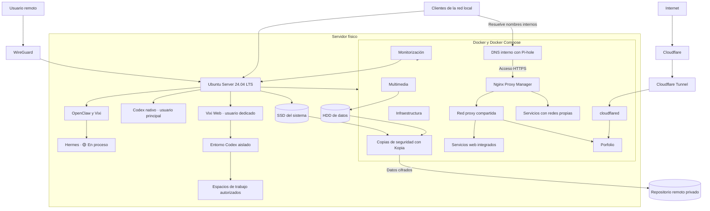
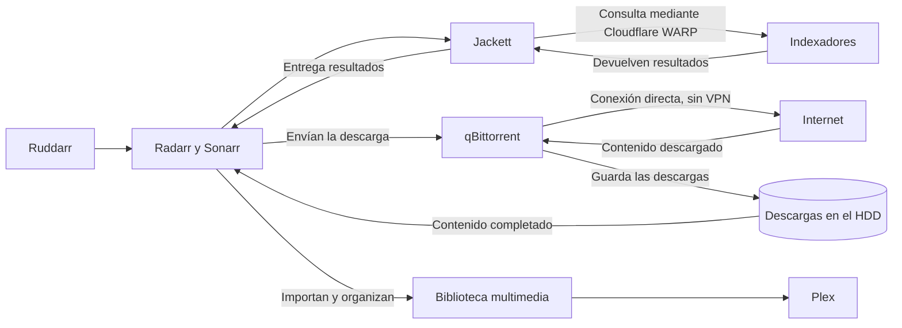

# Arquitectura

El homelab se concentra en un único servidor físico con Ubuntu Server 24.04 LTS. La mayoría de servicios se ejecutan en contenedores, mientras que OpenClaw y Codex nativo trabajan directamente sobre el sistema. El SSD contiene el sistema y los datos persistentes de las aplicaciones Docker. El HDD separado se utiliza principalmente para multimedia, descargas y datos de gran tamaño.

## Visión general

Los clientes de la LAN acceden directamente al servidor y a los servicios disponibles en la red local. WireGuard cubre el acceso remoto; no forma parte del recorrido normal dentro de la LAN.

## Servidor físico y sistema base

| Componente | Estado | Función |
|---|---|---|
| Servidor físico con Intel Core i5-6600K | ✅ Implementado | Aloja el sistema y los servicios del homelab. |
| 24 GB de RAM | ✅ Implementado | Memoria disponible para el host y los contenedores. |
| SSD dedicado | ✅ Implementado | Contiene Ubuntu Server y el entorno del sistema. |
| HDD de 2 TB | ✅ Implementado | Almacena principalmente datos y contenido multimedia. |
| Ubuntu Server 24.04 LTS | ✅ Implementado | Sistema operativo base. |

Separar el sistema de los datos simplifica la organización y evita que las bibliotecas multimedia compartan espacio con el disco del sistema. Esta separación física se complementa con copias cifradas y versionadas en almacenamiento remoto mediante Kopia.

## Contenedores y servicios

Uso Docker y Docker Compose como plataforma principal porque permiten mantener los servicios separados y definir sus dependencias de forma clara. No todo se ejecuta en contenedores: OpenClaw está instalado directamente en Ubuntu, igual que Codex nativo.

| Grupo | Servicios implementados | Papel en la arquitectura |
|---|---|---|
| Infraestructura | Pi-hole, WireGuard, wg-easy, Nginx Proxy Manager, Portainer, Uptime Kuma y Watchtower | DNS interno, acceso remoto, proxy inverso, administración y comprobaciones de disponibilidad. |
| Multimedia | Plex, Sonarr, Radarr, Jackett, qBittorrent, Ruddarr y Cloudflare WARP | Búsqueda, descarga, organización y reproducción de contenido. |
| Monitorización | Prometheus, Grafana, Node Exporter, cAdvisor, smartctl-exporter y Uptime Kuma | Métricas del host, contenedores, discos y disponibilidad de servicios. |
| Copias de seguridad | Kopia | Copias cifradas, versionadas y deduplicadas en almacenamiento remoto. |
| Publicación del porfolio | Porfolio, Gunicorn y cloudflared | Publicación web mediante Cloudflare Tunnel sin exponer el proxy inverso interno. |

Watchtower solo actualiza automáticamente servicios de monitorización seleccionados. Los servicios críticos o sensibles se mantienen con actualización manual.

Nginx Proxy Manager centraliza el acceso web interno. Los clientes consultan primero el DNS de Pi-hole y acceden después a los servicios mediante nombres internos y HTTPS válido. Los contenedores integrados comparten la red Docker `proxy`, pero conservan sus redes originales cuando las necesitan.

No todos los servicios están conectados directamente a esa red. Algunos mantienen su arquitectura o redes específicas y Nginx Proxy Manager llega a ellos por una ruta compatible. Así no hace falta forzar toda la infraestructura a una única topología.

El porfolio está conectado a su propia red Docker y a la red compartida `proxy`, por lo que Nginx Proxy Manager puede servirlo dentro de la LAN. La publicación pública sigue otra ruta: Internet, Cloudflare Tunnel, cloudflared y el contenedor del porfolio. Nginx Proxy Manager no forma parte de ese recorrido.

## Acceso local y remoto

- **Red local:** los clientes acceden directamente al servidor y a los servicios habilitados para la LAN.
- **Acceso web interno:** Pi-hole resuelve los nombres internos y Nginx Proxy Manager dirige cada petición al servicio correspondiente mediante HTTPS.
- **Acceso remoto:** WireGuard crea el acceso privado desde fuera de la red local.
- **Administración:** los servicios administrativos no se publican directamente en Internet.
- **Porfolio público:** es la única aplicación web publicada y utiliza Cloudflare Tunnel, sin abrir puertos web en el router.
- **Acceso directo de respaldo:** algunos servicios internos mantienen temporalmente sus puertos web anteriores mientras se comprueba la estabilidad del proxy. El porfolio de producción ya no conserva ese acceso directo.
- **Servicios locales:** Samba está limitado a la interfaz de red local.

UFW controla el acceso al servidor. Fail2ban protege SSH y AppArmor se aplica a los contenedores relevantes. La configuración detallada de estos controles se trata en [Seguridad](seguridad.md).

## Flujo multimedia

Sonarr administra las series y Radarr las películas. qBittorrent separa las descargas por categorías para que ambos gestores puedan importarlas en la biblioteca correspondiente. Plex consume después esas bibliotecas ya organizadas.

Cloudflare WARP se usa únicamente con Jackett por los bloqueos de algunos indexadores. qBittorrent mantiene salida directa y no utiliza esa VPN.

## Monitorización

Prometheus recoge métricas del host, de los contenedores y del estado SMART de los discos. Grafana se encarga de mostrarlas y Uptime Kuma comprueba la disponibilidad de los servicios. Node Exporter, cAdvisor y smartctl-exporter aportan las métricas de cada capa.

La cobertura actual tiene dos puntos abiertos:

- 🟡 **En proceso:** revisar la monitorización de la interfaz física de red. Node Exporter se ejecuta en un contenedor con su propio espacio de red y no ve directamente la interfaz física del servidor. Por eso faltan algunas métricas de red del host.
- 🟡 **En proceso:** completar las alertas avanzadas y las notificaciones.

## OpenClaw, Vixi, Hermes y Codex

OpenClaw está instalado directamente sobre Ubuntu. Vixi funciona como agente principal. Hermes ya existe como agente separado, pero su arquitectura de delegación, especialización y futuros subagentes sigue 🟡 **En proceso**.

Hay dos entornos de Codex con permisos distintos:

| Entorno | Ejecución | Alcance |
|---|---|---|
| Codex nativo | Usuario principal | Trabaja directamente sobre proyectos y espacios de trabajo con los permisos de ese usuario. |
| Codex aislado de Vixi Web | Usuario dedicado | Solo puede escribir en los espacios de trabajo autorizados. No tiene permiso de escritura sobre los datos generales, los datos persistentes de aplicaciones ni los metadatos internos de Git. |

Vixi Web se ejecuta como servicio `systemd` y mantiene el entorno aislado separado de Codex nativo. Esta división evita dar a todas las automatizaciones el mismo nivel de acceso al servidor.

## Decisiones principales

- **Un servidor físico:** el sistema y los servicios actuales están concentrados en una sola máquina; no hay una arquitectura distribuida.
- **Docker como opción principal, no única:** facilita separar y mantener los servicios. OpenClaw y Codex nativo se ejecutan directamente sobre el host.
- **Sistema y datos en discos separados:** facilita la organización y limita el impacto del crecimiento de las bibliotecas sobre el sistema base.
- **Acceso remoto mediante WireGuard:** mantiene el acceso desde fuera separado del acceso normal dentro de la LAN.
- **Permisos distintos para Codex:** Codex nativo conserva los permisos del usuario principal; Vixi Web usa un entorno separado y limitado.
- **Actualizaciones selectivas:** la automatización se aplica solo donde está prevista. Los componentes sensibles se revisan y actualizan manualmente.
- **Publicación separada del acceso interno:** Cloudflare Tunnel publica únicamente el porfolio; Nginx Proxy Manager mantiene su función dentro de la red privada.

## Evolución de la arquitectura

| Estado | Elemento |
|---|---|
| ✅ Implementado | Primera versión de la documentación pública del homelab. |
| ✅ Implementado | Copias de seguridad cifradas y versionadas con una restauración real validada. |
| ✅ Implementado | DNS interno, proxy inverso y HTTPS válido para los servicios web integrados. |
| ✅ Implementado | Porfolio desplegado y publicado mediante Cloudflare Tunnel. |
| 🟡 En proceso | Retirada progresiva del sistema de copias anterior basado en SMB. |
| 🟡 En proceso | Integración del estado de Kopia con las alertas centralizadas. |
| 🟡 En proceso | Revisión de métricas de red y ampliación de alertas. |
| 🟡 En proceso | Arquitectura de delegación, especialización y futuros subagentes de Hermes. |
| 🟡 En proceso | Retirada progresiva de los accesos web directos de otros servicios internos. |
| ⬜ Pendiente | Autenticación centralizada y claves de acceso (*passkeys*). |
| ⬜ Pendiente | Integración de OpenClaw con Telegram y, más adelante, WhatsApp. |
