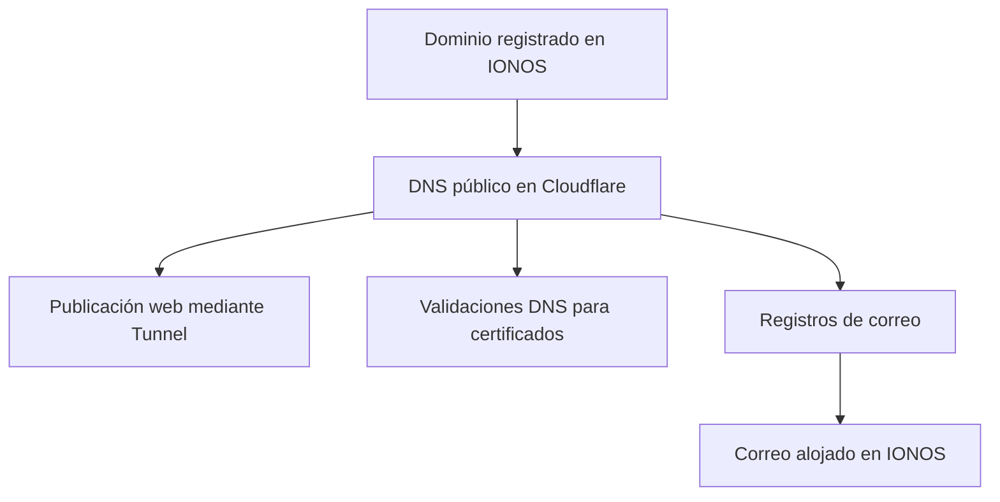

# Dominio, DNS público y correo

> **Estado general: 🟡 En proceso**

El dominio `vixstack.es` continúa registrado en IONOS, pero el DNS público autoritativo se gestiona desde Cloudflare. El correo sigue alojado en IONOS: trasladar la autoridad DNS no implicó migrar el servicio de correo.

## Separación de responsabilidades

Cloudflare cubre varias funciones distintas: mantiene el DNS público, permite las validaciones DNS de los certificados, publica el porfolio mediante Cloudflare Tunnel y aplica la redirección de `www` al dominio canónico.

IONOS conserva el registro del dominio y el alojamiento del correo. Durante la migración del DNS se mantuvieron los registros necesarios para que ese servicio siguiera funcionando.

## Estado del correo

| Elemento | Estado | Situación |
|---|---|---|
| Migración del DNS público | ✅ Implementado | La autoridad DNS se trasladó a Cloudflare. |
| Registros MX | ✅ Implementado | Están presentes después de la migración. |
| SPF | ✅ Implementado | Se ha comprobado públicamente. |
| DKIM | ✅ Implementado | Se ha comprobado públicamente. |
| DMARC | 🟡 En proceso | Ya está publicado en modo de observación; queda decidir si conviene aplicar una política más estricta. |
| Funcionamiento del correo | ✅ Implementado | Se ha comprobado después de la migración del DNS. |

## Criterio de publicación

La documentación explica cómo se reparten las responsabilidades, pero no incluye *nameservers*, servidores de correo, valores de los registros DNS, selectores, direcciones ni configuración de cuentas.
