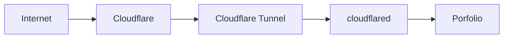

# Integración con el porfolio

> **Estado general: ✅ Implementado**

El homelab es uno de los proyectos principales de mi porfolio, ya publicado en [vixstack.es](https://vixstack.es). La web enseña qué he montado, las decisiones que he tomado y cómo ha ido evolucionando, sin presentarlo como una infraestructura empresarial ni publicar detalles internos que no aportan nada.

El porfolio web y este repositorio son proyectos separados. La web presenta el caso de forma resumida y la documentación de GitHub permite profundizar en la parte técnica.

## Qué muestra el porfolio

La presentación se centra en:

- el objetivo del homelab;
- una visión general de la arquitectura;
- las tecnologías principales;
- decisiones técnicas y motivos;
- problemas encontrados, aprendizajes y mejoras pendientes;
- enlaces a la documentación pública que aporte contexto.

También pueden incluirse diagramas o capturas cuando ayudan a entender el proyecto y están revisados para uso público.

## Relación con la documentación

El porfolio está pensado para leerse rápido. No duplica toda la documentación: resume el proyecto y enlaza desde las partes relevantes a los documentos de este repositorio en GitHub.

Mantener separados el código de la web y la documentación permite actualizar cada parte sin mezclar el desarrollo del porfolio con el contenido técnico del homelab.

## Publicación

El porfolio se ejecuta en Docker con Gunicorn y está publicado mediante Cloudflare Tunnel. No hace falta abrir puertos web en el router ni exponer Nginx Proxy Manager, que continúa dedicado al acceso interno del homelab.

El contenedor del porfolio y cloudflared se ejecutan con aislamiento y mínimo privilegio. El porfolio tiene healthcheck propio y la conexión del túnel está comprobada. El subdominio `www` redirige de forma permanente al dominio canónico y conserva las rutas y los parámetros de la URL.

La publicación fuerza HTTPS, utiliza TLS moderno y aplica HSTS de forma conservadora al dominio público. Cloudflare aporta una protección básica frente a bots y el propio porfolio entrega cabeceras HTTP de seguridad. La configuración detallada queda fuera de este documento.

También se ha retirado el antiguo acceso directo de producción desde la LAN. El porfolio continúa disponible mediante Cloudflare Tunnel y la infraestructura interna necesaria, pero ya no mantiene esa exposición adicional.

## Criterio de publicación y privacidad

Solo se publica información que ayuda a explicar la arquitectura, las decisiones o el aprendizaje. Quedan fuera las direcciones de red, puertos, credenciales, secretos, reglas internas de acceso y cualquier captura que revele datos sensibles.

Los diagramas y ejemplos deben estar saneados. Si un detalle permite localizar, reconstruir o facilitar el acceso al entorno, no tiene sitio ni en el porfolio ni en la documentación pública.

## Estado actual

| Elemento | Estado | Situación |
|---|---|---|
| Separación de proyectos | ✅ Implementado | El porfolio y la documentación se mantienen en proyectos distintos. |
| Documentación pública v1 | ✅ Implementado | La primera versión está cerrada y sirve como base técnica del porfolio. |
| Porfolio web | ✅ Implementado | Está finalizado, desplegado en Docker y comprobado como saludable. |
| Integración del homelab | ✅ Implementado | Resume el proyecto y enlaza a la documentación técnica seleccionada. |
| Publicación en `vixstack.es` | ✅ Implementado | Es el dominio canónico y se publica mediante Cloudflare Tunnel. |
| Redirección de `www` | ✅ Implementado | Redirige de forma permanente al dominio canónico. |
| Protección web básica | ✅ Implementado | HTTPS obligatorio, TLS moderno, HSTS conservador y protección básica de Cloudflare. |
| Retirada del acceso directo de producción | ✅ Implementado | El antiguo acceso adicional desde la LAN está retirado. |

## Mantenimiento

El contenido se revisará cuando cambien la arquitectura o el estado del proyecto. El porfolio mantendrá el resumen y esta documentación recogerá el detalle confirmado.
