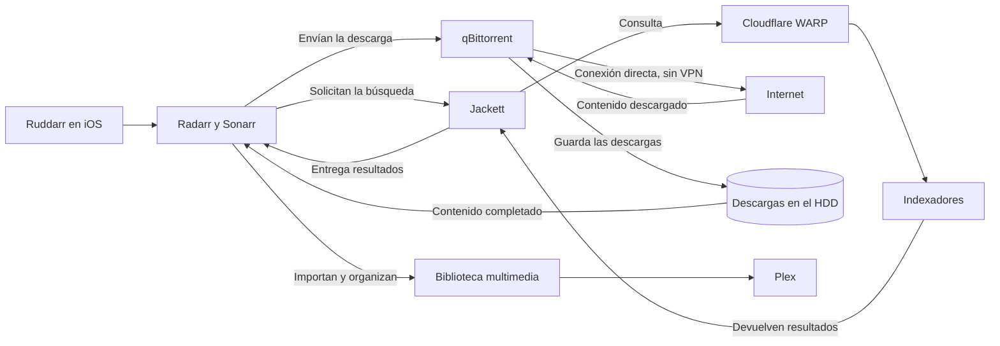

# Multimedia

> **Estado: ✅ Implementado**

El flujo multimedia conecta varias herramientas, pero cada una tiene una función concreta. Ruddarr sirve como punto de entrada desde iOS, Radarr y Sonarr coordinan el proceso, Jackett se ocupa de las búsquedas, qBittorrent descarga el contenido y Plex reproduce la biblioteca final.

## Flujo general

## Búsqueda y descarga

Desde Ruddarr gestiono Radarr para las películas y Sonarr para las series. Cuando uno de los dos necesita buscar contenido, envía la consulta a Jackett. Jackett centraliza el acceso a los indexadores y devuelve los resultados a Radarr o Sonarr, que eligen qué enviar a qBittorrent.

Cloudflare WARP se aplica únicamente a las consultas de Jackett. qBittorrent no utiliza esa VPN: descarga directamente a Internet y guarda el contenido en el HDD.

Esto separa la búsqueda de *releases* de la descarga real. WARP resuelve los bloqueos que afectan a algunos indexadores sin desviar el resto del tráfico multimedia.

## Organización e importación

qBittorrent utiliza una categoría para Sonarr y otra para Radarr. Así, cada gestor puede reconocer sus descargas terminadas e importarlas en la biblioteca que corresponde.

Sonarr organiza las series por serie y temporada. Radarr mantiene cada película en su propia carpeta. Hay perfiles de calidad diferenciados para 1080p y 4K.

Las descargas y la biblioteca final son etapas distintas. Radarr y Sonarr recogen el contenido completado, lo organizan y lo llevan a la biblioteca definitiva.

## Plex

Plex consume la biblioteca ya organizada por Radarr y Sonarr. No busca contenido, no gestiona las descargas y no trabaja directamente sobre las carpetas de descarga de qBittorrent.

## Decisiones técnicas

- **WARP solo para Jackett:** limita la VPN al servicio que la necesita.
- **qBittorrent con salida directa:** la descarga del contenido no pasa por VPN.
- **Categorías separadas:** permiten que Radarr y Sonarr identifiquen e importen sus propias descargas.
- **Descarga y biblioteca separadas:** Plex solo ve el contenido después de que Radarr o Sonarr lo hayan organizado.
