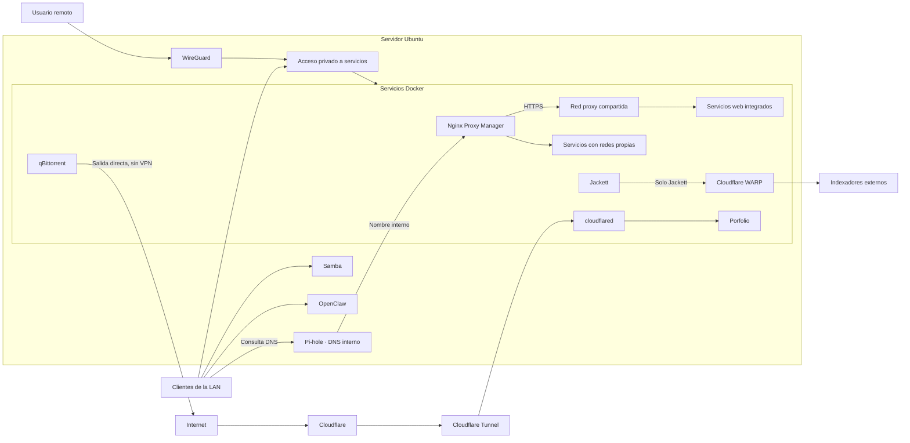

# Red

La red del homelab parte de una idea sencilla: dentro de la LAN, Pi-hole resuelve los nombres internos y Nginx Proxy Manager centraliza el acceso web mediante HTTPS. Para entrar desde fuera utilizo WireGuard. Cloudflare WARP no sustituye ese acceso remoto ni afecta a todo el servidor; solo se usa para las consultas de Jackett.

## Visión general

El acceso desde la LAN y el acceso remoto terminan en el mismo servidor, pero siguen caminos distintos. WireGuard solo interviene cuando la conexión llega desde fuera. El tráfico local normal no pasa por la VPN.

## Acceso desde la LAN

Los equipos de la red local acceden directamente al servidor y a los servicios que tienen habilitados. No hay un salto previo por WireGuard.

Pi-hole forma parte de esta capa local, proporciona filtrado DNS y resuelve los nombres internos. Los clientes configurados para utilizarlo pueden acceder a las interfaces web sin depender de direcciones y puertos en el uso diario.

Nginx Proxy Manager recibe esas peticiones, aplica HTTPS y las dirige al servicio correspondiente. Los contenedores que lo necesitan comparten la red Docker `proxy` y mantienen también sus redes originales cuando corresponde. Otros servicios conservan su arquitectura específica y siguen siendo accesibles para el proxy sin conectarlos directamente a esa red.

Samba también queda dentro de la LAN y está limitado a la interfaz de red local. Los puertos web directos anteriores de otros servicios siguen disponibles temporalmente como respaldo mientras se comprueba la estabilidad del nuevo acceso.

El porfolio de producción ya no mantiene su antiguo acceso directo desde la LAN. Dentro de la red se gestiona mediante las redes Docker necesarias y, desde Internet, solo se alcanza a través de Cloudflare Tunnel.

## Acceso remoto mediante WireGuard

WireGuard proporciona el acceso privado desde fuera de la red local. wg-easy se utiliza para administrarlo.

Una conexión remota entra primero por WireGuard y, desde ahí, puede alcanzar los recursos privados que tenga autorizados. El acceso a cada servicio debe comprobarse por separado. Esto no convierte WireGuard en la salida general a Internet del servidor ni cambia el tráfico habitual de los clientes de la LAN.

## Alcance de los servicios

| Servicio o grupo | Alcance confirmado | Estado |
|---|---|---|
| Pi-hole | Clientes de la red local. | ✅ Implementado |
| DNS interno | Resolución de nombres internos para los clientes configurados con Pi-hole. | ✅ Implementado |
| Nginx Proxy Manager | Proxy inverso para el acceso web dentro de la red privada. | ✅ Implementado |
| HTTPS interno | Certificados válidos para los servicios gestionados por el proxy. | ✅ Implementado |
| Porfolio | Único servicio publicado en Internet. | ✅ Implementado |
| Cloudflare Tunnel | Publica el porfolio sin abrir puertos web en el router. | ✅ Implementado |
| Acceso LAN directo del porfolio | Retirado de la instancia de producción. | ✅ Implementado |
| Samba | Solo la interfaz de la LAN. | ✅ Implementado |
| OpenClaw | Accesible desde la LAN y protegido por firewall, sin exposición pública directa. | ✅ Implementado |
| Servicios administrativos | Se mantienen en acceso privado. El acceso remoto debe validarse por servicio. | ✅ Implementado |
| Puertos web directos anteriores | Se mantienen temporalmente como vía de respaldo. | 🟡 En proceso |
| Autenticación centralizada | No desplegada. | ⬜ Pendiente |

OpenClaw está instalado directamente sobre Ubuntu, no dentro de Docker.

## Tráfico normal, WireGuard, WARP y Tunnel

Las cuatro rutas cumplen funciones distintas:

### Tráfico normal

Los clientes de la LAN hablan directamente con el servidor. Dentro del flujo multimedia, qBittorrent utiliza la salida directa y Jackett es la única excepción que pasa por WARP.

### WireGuard

WireGuard cubre el acceso remoto de usuarios autorizados. No transporta por defecto todo el tráfico del servidor ni el de los clientes locales.

### Cloudflare WARP

WARP se limita a Jackett porque algunos indexadores presentan bloqueos. El recorrido de esa consulta es:

`Radarr/Sonarr → Jackett → WARP → indexadores → Jackett → Radarr/Sonarr`

qBittorrent queda fuera de ese recorrido. Recibe las descargas desde Radarr o Sonarr y descarga mediante salida directa, sin VPN.

### Cloudflare Tunnel

Cloudflare Tunnel se utiliza únicamente para publicar el porfolio. El tráfico público llega a Cloudflare, pasa por el túnel y alcanza cloudflared y el contenedor del porfolio mediante la red Docker compartida.

WARP y Tunnel no cumplen la misma función: WARP sigue limitado a las consultas de Jackett y Tunnel cubre la publicación web. Nginx Proxy Manager tampoco interviene en el recorrido público.

## Criterio de exposición

El proxy inverso y HTTPS se utilizan dentro de la red privada. El porfolio es la única aplicación web pública y se publica mediante Cloudflare Tunnel, sin abrir puertos web en el router ni mantener un acceso directo adicional para la instancia de producción. El resto de servicios, incluidos los administrativos, continúa siendo privado.

## Pendiente

- 🟡 **Puertos web directos:** valorar su retirada cuando el acceso mediante proxy lleve suficiente tiempo estable.
- ⬜ **Autenticación centralizada** para los servicios que lo necesiten.
