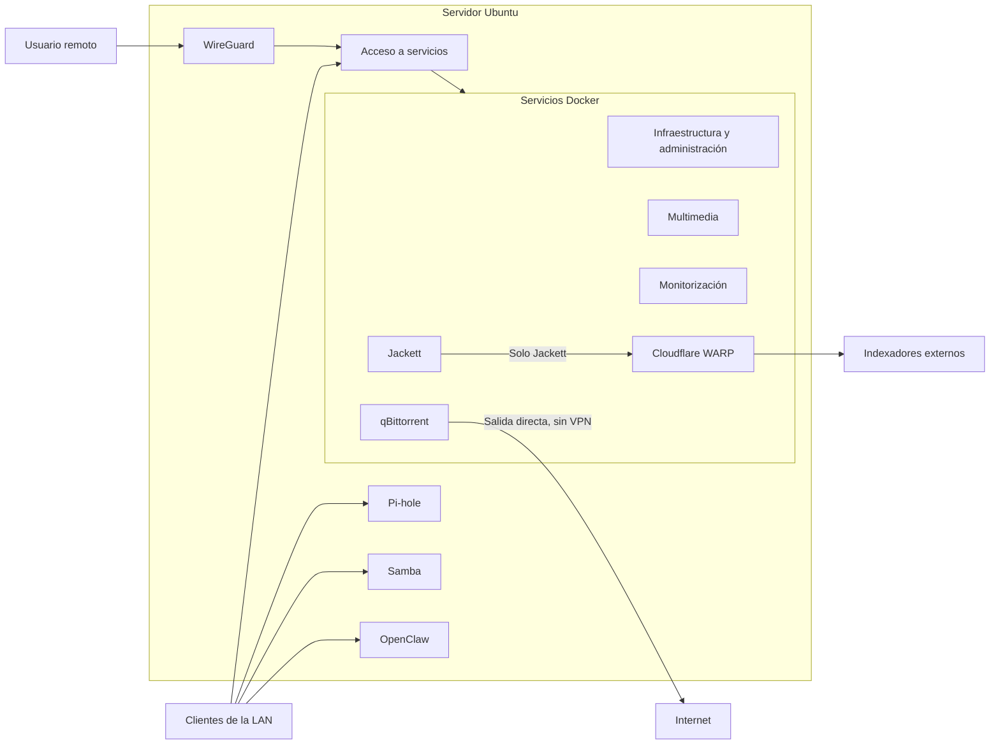

# Red

La red del homelab parte de una idea sencilla: dentro de la LAN, los clientes acceden directamente al servidor y a sus servicios. Para entrar desde fuera utilizo WireGuard. Cloudflare WARP no sustituye ese acceso remoto ni afecta a todo el servidor; solo se usa para las consultas de Jackett.

## Visión general

El acceso desde la LAN y el acceso remoto terminan en el mismo servidor, pero siguen caminos distintos. WireGuard solo interviene cuando la conexión llega desde fuera. El tráfico local normal no pasa por la VPN.

## Acceso desde la LAN

Los equipos de la red local acceden directamente al servidor y a los servicios que tienen habilitados. No hay un salto previo por WireGuard.

Pi-hole forma parte de esta capa local y proporciona filtrado DNS a sus clientes. Samba también queda dentro de la LAN y está limitado a la interfaz de red local.

Los servicios Docker se ejecutan sobre el mismo servidor. Los que necesitan acceso desde la LAN se publican a través del host; los demás permanecen únicamente dentro de las redes internas de Docker.

## Acceso remoto mediante WireGuard

WireGuard proporciona el acceso privado desde fuera de la red local. wg-easy se utiliza para administrarlo.

Una conexión remota entra primero por WireGuard y, desde ahí, puede alcanzar los recursos privados que tenga autorizados. El acceso a cada servicio debe comprobarse por separado. Esto no convierte WireGuard en la salida general a Internet del servidor ni cambia el tráfico habitual de los clientes de la LAN.

## Alcance de los servicios

| Servicio o grupo | Alcance confirmado | Estado |
|---|---|---|
| Pi-hole | Clientes de la red local. | ✅ Implementado |
| Samba | Solo la interfaz de la LAN. | ✅ Implementado |
| OpenClaw | Accesible desde la LAN y protegido por firewall, sin exposición pública directa. | ✅ Implementado |
| Servicios administrativos | Se mantienen en acceso privado. El acceso remoto debe validarse por servicio. | ✅ Implementado |
| Proxy inverso para servicios públicos | No desplegado. | ⬜ Pendiente |
| HTTPS para servicios públicos | No desplegado. | ⬜ Pendiente |
| Autenticación centralizada | No desplegada. | ⬜ Pendiente |

OpenClaw está instalado directamente sobre Ubuntu, no dentro de Docker. El acceso remoto mediante WireGuard todavía no se ha verificado.

## Tráfico normal, WireGuard y WARP

Las tres rutas cumplen funciones distintas:

### Tráfico normal

Los clientes de la LAN hablan directamente con el servidor. Dentro del flujo multimedia, qBittorrent utiliza la salida directa y Jackett es la única excepción que pasa por WARP.

### WireGuard

WireGuard cubre el acceso remoto de usuarios autorizados. No transporta por defecto todo el tráfico del servidor ni el de los clientes locales.

### Cloudflare WARP

WARP se limita a Jackett porque algunos indexadores presentan bloqueos. El recorrido de esa consulta es:

`Radarr/Sonarr → Jackett → WARP → indexadores → Jackett → Radarr/Sonarr`

qBittorrent queda fuera de ese recorrido. Recibe las descargas desde Radarr o Sonarr y descarga mediante salida directa, sin VPN.

## Criterio de exposición

Por defecto, los servicios se mantienen en la red privada. Cualquier excepción futura deberá decidirse de forma explícita; la capa necesaria para publicarlos todavía no está desplegada.

## Pendiente

- ⬜ **Proxy inverso** para centralizar el acceso web a los servicios que se decidan publicar.
- ⬜ **HTTPS** para los servicios públicos.
- ⬜ **Autenticación centralizada** para los servicios que lo necesiten.
